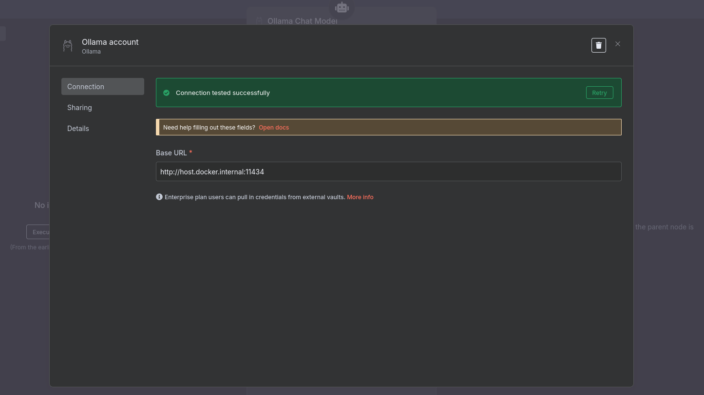

# Ollama

Ollama must be run locally and listening to all ip to make it accessible from a container

## Start ollama locally listening on all ip
```shell
OLLAMA_HOST=0.0.0.0 ollama serve && ps aux | grep ollama
```

## List ollama processes
```shell
ps aux | grep ollama
```

## get listen ip bound with 11434
```shell
ss -tuln | grep 11434
```

## Process on port
```shell
sudo netstat -nlp | grep :11434
```

## Killall ollama
```shell
sudo killall ollama && ps aux | grep ollama
```

## n8n container



http://host.docker.internal:11434

# Container
```shell
docker ps
```

```shell
docker exec -it sample-n8n-n8n-1 sh
```

# n8n
http://localhost:5678/

## list community nodes
http://localhost:5678/settings/community-nodes

# neo4j

- Connection URI: bolt://host.docker.internal:7687
- Username: neo4j
- Password: neo4j damien1983

Create relationship not implemented ! https://github.com/Kurea/n8n-nodes-neo4j/blob/main/src/nodes/Neo4j/Neo4j.node.ts#L370

https://neo4j.com/docs/operations-manual/current/docker/ref-settings/

MATCH (n) DETACH DELETE n
